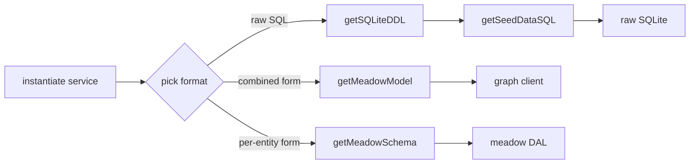

# API Reference

Complete reference for the public API of `retold-sample-data`. The service exposes seven methods, all synchronous, all read-only. Each has its own dedicated page with a code snippet.

## Service Registration

```javascript
const libFable = require('fable');
const libRetoldSampleData = require('retold-sample-data');

const _Fable = new libFable();
_Fable.serviceManager.addServiceType('RetoldSampleData', libRetoldSampleData);

let _SampleData = _Fable.serviceManager.instantiateServiceProvider('RetoldSampleData');
```

No options — the service is stateless and reads from its bundled schema directory on demand.

## Methods

| Method | Purpose | Details |
|--------|---------|---------|
| [`getBookstoreSchemaPath()`](api-getBookstoreSchemaPath.md) | Return the absolute path to the schema directory inside the package | [Details](api-getBookstoreSchemaPath.md) |
| [`getMeadowModel()`](api-getMeadowModel.md) | Parse and return `MeadowModel.json` — the combined 12-entity model | [Details](api-getMeadowModel.md) |
| [`getSchema()`](api-getSchema.md) | Parse and return `Schema.json` — the `retold-data-service` variant | [Details](api-getSchema.md) |
| [`getMeadowSchema(pEntityName)`](api-getMeadowSchema.md) | Parse and return an individual per-entity `MeadowSchema<Name>.json` | [Details](api-getMeadowSchema.md) |
| [`getEntityList()`](api-getEntityList.md) | Return the array of entity names (keys of `MeadowModel.Tables`) | [Details](api-getEntityList.md) |
| [`getSQLiteDDL()`](api-getSQLiteDDL.md) | Return the raw `CREATE TABLE` SQL as a string | [Details](api-getSQLiteDDL.md) |
| [`getSeedDataSQL()`](api-getSeedDataSQL.md) | Return the raw `INSERT` seed SQL as a string | [Details](api-getSeedDataSQL.md) |

## Return Shapes Cheat-Sheet

| Method | Returns |
|--------|---------|
| `getBookstoreSchemaPath()` | `string` (absolute path) |
| `getMeadowModel()` | `object` with `Tables: { EntityName: { TableName, Domain, Columns: [...] } }` |
| `getSchema()` | `object` with `Tables: { EntityName: { TableName, Domain, Columns: [...] } }` |
| `getMeadowSchema(name)` | `object` in meadow package format — `{ Scope, DefaultIdentifier, Schema: [...], DefaultObject, JsonSchema, Authorization }` |
| `getEntityList()` | `string[]` of 12 entity names |
| `getSQLiteDDL()` | `string` (raw SQL) |
| `getSeedDataSQL()` | `string` (raw SQL) |

## Typical Usage Flow



## Method Details

### Read-only File Access

Every method reads from `source/schemas/bookstore/` **on every call**. There's no in-memory caching. For long-running processes you'll typically call each method once at startup and cache the result in your own application state:

```javascript
const _Fixture = {
    model: _SampleData.getMeadowModel(),
    ddl: _SampleData.getSQLiteDDL(),
    seedSQL: _SampleData.getSeedDataSQL(),
    entities: _SampleData.getEntityList()
};
```

That's cheap — the files are small (the biggest is the ~30K-line seed SQL) and parsing JSON is fast. But re-reading them from disk on every call is still wasted work if you know you'll call the same method repeatedly.

## Error Handling

All the JSON-parsing methods throw if the underlying file is missing or malformed:

- `getMeadowModel()` — throws if `MeadowModel.json` is missing or invalid JSON
- `getSchema()` — throws if `Schema.json` is missing or invalid JSON
- `getMeadowSchema(name)` — throws if `MeadowSchema<name>.json` is missing or invalid JSON

The SQL-returning methods throw if the underlying SQL file is missing:

- `getSQLiteDDL()` — throws if `BookStore-CreateSQLiteTables.sql` is missing
- `getSeedDataSQL()` — throws if `BookStore-SeedData.sql` is missing

In the normal case — you've installed the package via npm and haven't edited the `node_modules/retold-sample-data/source/schemas/` directory — these throws never happen. The files are part of the package and shipped on every install.

## Stateless vs Fable

The service extends `fable-serviceproviderbase`, so it looks like a standard Fable service. But in practice it has no configuration, no state, and doesn't use any Fable features except inherited plumbing (logger, service hash). You can use it without fable at all if you pass minimal stubs:

```javascript
const libRetoldSampleData = require('retold-sample-data');
const _SampleData = new libRetoldSampleData({}, {});
_SampleData.getBookstoreSchemaPath();  // works
```

This isn't formally supported — it's a side effect of the current implementation that the read methods don't depend on Fable features. If you need a robust integration, pass a real Fable instance.

## Related

- [Quick Start](quickstart.md) — the fast walkthrough
- [Schema Overview](schema.md) — what the data looks like
- [Using With Meadow](using-with-meadow.md) — integration recipes that call these methods
