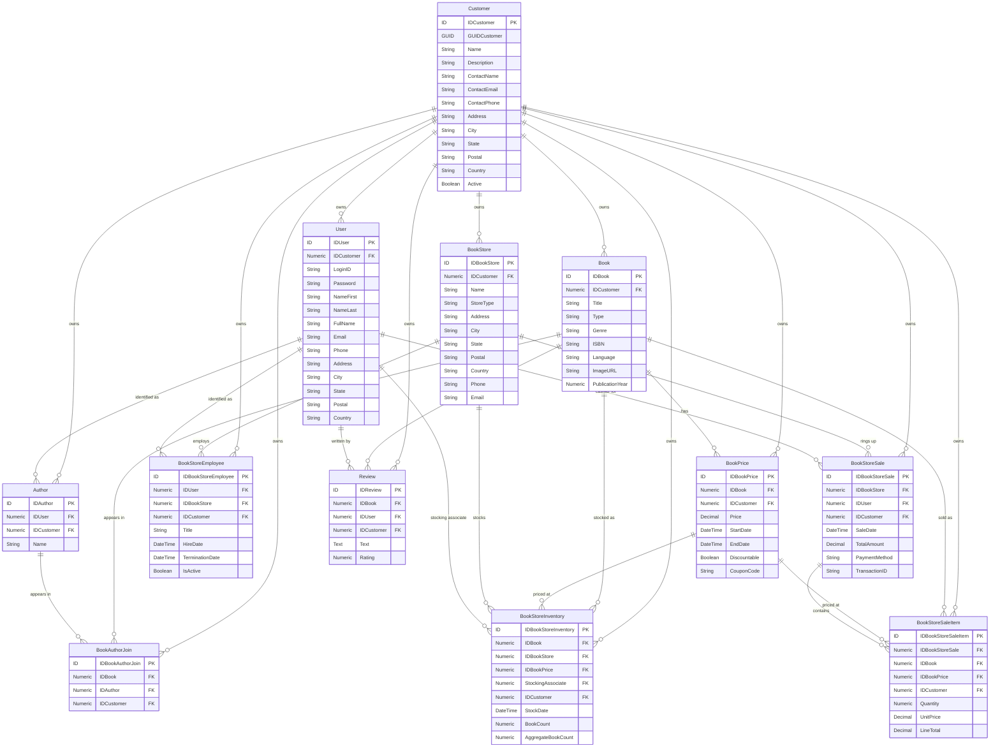

# Schema Overview

The bookstore schema has 12 entities wired together with foreign-key joins on ID columns, following the standard Retold/Meadow naming conventions (`ID<EntityName>` primary keys, audit columns, multi-tenant `IDCustomer` on every table). This page walks through the high-level shape, the join relationships as a Mermaid ER diagram, and the design decisions behind a few non-obvious bits.

## Design Principles

Before diving into the diagram:

- **Every entity is multi-tenant.** Every table carries an `IDCustomer` column so the schema demonstrates the Retold tenant-isolation pattern. In production queries you'd always filter by `IDCustomer`. In the sample data everything belongs to one customer so the filtering is mostly a no-op but the shape is still there.
- **Audit columns are ubiquitous.** Every non-join table has `CreateDate`, `CreatingIDUser`, `UpdateDate`, `UpdatingIDUser`, `Deleted`, `DeleteDate`, `DeletingIDUser`. Soft-delete is the convention -- records set `Deleted = 1` rather than being physically removed.
- **Join tables are prefixed `IDBook<Other>Join`.** `BookAuthorJoin` is the only many-to-many join table in the schema. It follows the `ID<From><To>Join` convention that `meadow-graph-client` recognizes and weights preferentially during graph traversal.
- **GUIDs travel alongside IDs.** Every entity has both `ID<Name>` (integer primary key) and `GUID<Name>` (UUID) columns. The ID is for relational joining; the GUID is for cross-system reference without collision risk.

## Entity Relationship Diagram



## The Core Publishing Graph

The heart of the schema is the classic many-to-many between `Book` and `Author` via `BookAuthorJoin`:

```
Book <--> BookAuthorJoin <--> Author
```

A book can have multiple authors (co-authorship), an author can write multiple books. Reading the join cardinality from the seed data:

- 22 books
- 13 authors
- 27 book-author pairings (slightly more than either side, meaning several books have multiple co-authors)

This is the canonical case `meadow-graph-client` tests against -- when you ask for "all books by a specific author" it traverses `Book -> BookAuthorJoin -> Author`. The weighting heuristics in the graph solver favor this specific path because `BookAuthorJoin` ends in the suffix `Join` (see [meadow-graph-client's solver docs](https://github.com/stevenvelozo/meadow-graph-client/blob/master/docs/api-solveGraphConnections.md) for how that scoring works).

## The Pricing Graph

`BookPrice` hangs off `Book` as a one-to-many -- a single book can have multiple price records over time, letting you model historical pricing, promotional discounts, and coupon-specific prices:

```
Book -> BookPrice (1:N)
```

Each `BookPrice` carries `StartDate`, `EndDate`, `Discountable`, and `CouponCode` so queries like "the currently-active price for this book" are expressible without touching the data model.

## The Store Operations Graph

The store-side of the schema is a chain that pins a physical location to its staff, inventory, and sales:

```
BookStore
  ├── BookStoreEmployee (N:1 to User)
  ├── BookStoreInventory (N:1 to Book, N:1 to BookPrice)
  └── BookStoreSale (N:1 to User as cashier)
        └── BookStoreSaleItem (N:1 to Book, N:1 to BookPrice)
```

A `BookStoreSale` is one transaction with a total and a payment method. A `BookStoreSaleItem` is one line in that transaction -- a single book at a specific price in a specific quantity. This two-level sale structure is the standard POS pattern and lets you run "top 10 books sold last month" queries without duplicating sale-level data across line items.

## The User and Review Graph

`User` is the identity table. Several entities reference it:

- `Author.IDUser` -- optional link from an author identity to a login identity (an author might also be a user of the system)
- `BookStoreEmployee.IDUser` -- the login associated with this store employee
- `BookStoreSale.IDUser` -- the cashier who rang up the sale
- `BookStoreInventory.StockingAssociate` -- the employee who stocked the inventory (aliased column name, not `IDUser`)
- `Review.IDUser` -- the reviewer

Note the `StockingAssociate` oddity: it's a foreign key to `IDUser` but the column name is different. This is the one place the schema deliberately breaks the `ID<TargetEntity>` naming convention, to document that `meadow-graph-client`'s solver can be steered to unusual joins with hints and manual paths -- it's a test fixture for that feature.

## Ignored Audit Joins

Every non-join entity has these columns, all referencing `User`:

- `CreatingIDUser`
- `UpdatingIDUser`
- `DeletingIDUser`

`meadow-graph-client` **deliberately ignores** these when building its graph (they're in its hard-coded skip list alongside `IDCustomer`). If the graph solver didn't ignore them, every entity would be one hop away from `User` via these audit columns and the graph would collapse to a star topology. The schema includes them because they're essential for real applications -- but the solver treats them as metadata, not as graph edges.

If you want to traverse "who created this book?" you can do it directly via meadow's normal filter syntax; you just won't see the solver automatically picking it as a candidate path.

## Column Naming Conventions

| Pattern | Meaning |
|---------|---------|
| `ID<Name>` (data type `ID`) | Primary key, AutoIdentity |
| `GUID<Name>` | UUID; travels alongside the primary key |
| `ID<OtherEntity>` with `Join` metadata | Foreign key to `<OtherEntity>.ID<OtherEntity>` |
| `CreateDate`, `CreatingIDUser` | Set on record creation by Meadow's lifecycle hooks |
| `UpdateDate`, `UpdatingIDUser` | Set on every update |
| `Deleted`, `DeleteDate`, `DeletingIDUser` | Set on soft-delete |
| `IDCustomer` | Multi-tenant owner -- set on every table; ignored by the graph solver |

Following these conventions is what lets downstream tools (the graph solver, the offline provider, `retold-data-service`) operate on the schema without any per-table configuration.

## Design Decisions Worth Knowing

**Why not foreign-key constraints in the DDL?**
The SQLite DDL intentionally doesn't declare `FOREIGN KEY` clauses. Meadow enforces referential integrity at the application layer (through join-column metadata and query generation), and leaving the DB-level constraints off makes the seed script order-independent and speeds up bulk loads.

**Why is `GUIDUser` declared as `Numeric`?**
Historical quirk. The intent was a true GUID (and some tests treat it as one) but the source `MeadowModel.json` has it as `Numeric`. This is a known-weird corner that exists for backwards compatibility with earlier tests. Don't copy it.

**Why only 1 row for Customer, BookStore, Review, etc. in the seed?**
The main seed covers the common test cases -- graph traversal of the book/author relationship, basic CRUD on every entity, dirty-tracking behaviors. Scenarios that need bigger test populations tend to generate their own data on top of the seed rather than trying to pre-populate everything. The `BookStore-SeedData-Extended.sql` file exists for cases that want an alternate small set.

**Why is `BookStoreInventory.StockingAssociate` not named `IDStockingUser`?**
Deliberate. The solver's default naming convention (`ID<TargetEntity>`) doesn't match this column, which gives `meadow-graph-client` a concrete test case for its hinting and manual-path features. In production schemas you'd normally pick a conventional name unless you had a specific reason not to.

## Related

- [Entity Reference](entities.md) -- per-entity column lists with types and sizes
- [Seed Data](seed-data.md) -- what's in the rows
- [Using With Meadow](using-with-meadow.md) -- walkthroughs that depend on the schema shape
